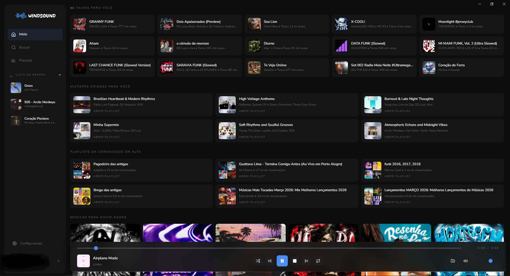
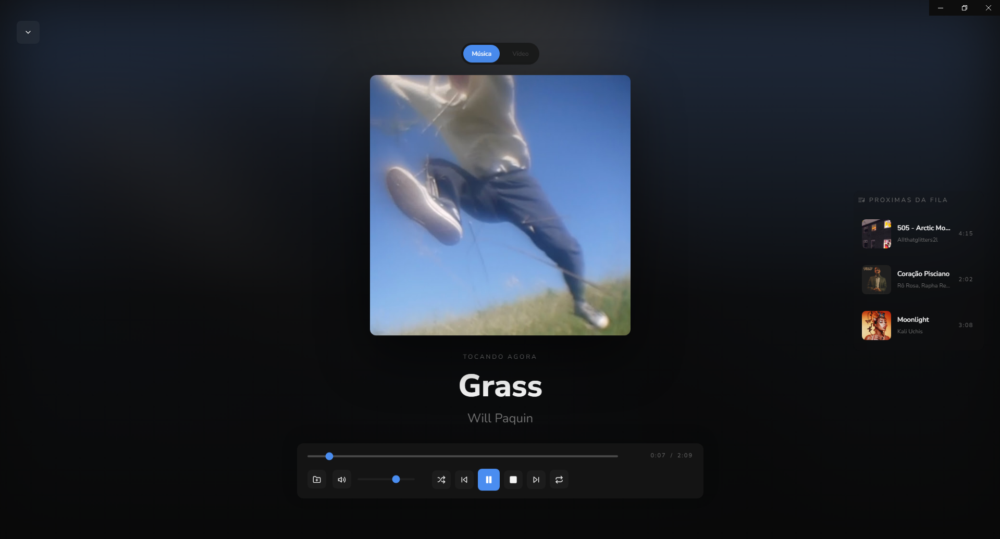

<div align="center">

<br/>

```text
██╗    ██╗██╗███╗   ██╗██████╗ ███████╗ ██████╗ ██╗   ██╗███╗   ██╗██████╗
██║    ██║██║████╗  ██║██╔══██╗██╔════╝██╔═══██╗██║   ██║████╗  ██║██╔══██╗
██║ █╗ ██║██║██╔██╗ ██║██║  ██║███████╗██║   ██║██║   ██║██╔██╗ ██║██║  ██║
██║███╗██║██║██║╚██╗██║██║  ██║╚════██║██║   ██║██║   ██║██║╚██╗██║██║  ██║
╚███╔███╔╝██║██║ ╚████║██████╔╝███████║╚██████╔╝╚██████╔╝██║ ╚████║██████╔╝
 ╚══╝╚══╝ ╚═╝╚═╝  ╚═══╝╚═════╝ ╚══════╝ ╚═════╝  ╚═════╝ ╚═╝  ╚═══╝╚═════╝
```

**Um player de música moderno, alimentado pelo YouTube Music.**

[](https://github.com)
[](https://github.com)
[](https://github.com)
[](LICENSE)

</div>

---

> ⚠️ **Aviso:** Este projeto está em desenvolvimento ativo e em fase **beta**. Bugs são esperados. Contribuições e feedbacks são muito bem-vindos.

---

## 🎵 O que é o WindSound?

**WindSound** é um player de música desktop em desenvolvimento que utiliza a **Innertube API** para buscar, organizar e reproduzir músicas diretamente do YouTube Music. Com login via conta do usuário, o app oferece uma experiência mais personalizada, com home conectada, busca integrada e fila inteligente.

O projeto nasceu com a ideia de criar uma interface musical limpa e intuitiva, aproveitando o enorme acervo disponível no YouTube, sem depender de serviços de streaming pagos.

---

<div align="center">
  
  
</div>

## ✨ Funcionalidades atuais

- 🔐 **Login com YouTube Music** — autenticação pela conta do usuário no app desktop
- 🎶 **Reprodução de músicas** — streaming com backend local
- 🔍 **Busca integrada** — músicas e playlists
- 📋 **Fila de reprodução** — controle da próxima sequência
- 🧠 **Rádio automática** — continua músicas parecidas quando necessário
- 🎨 **Tema customizável** — interface escura com identidade própria

> 🚧 Mais funcionalidades estão sendo desenvolvidas.

---

## 🛠️ Stack

| Tecnologia | Uso |
|---|---|
| **Electron** | Aplicação desktop |
| **React + TypeScript** | Interface |
| **Vite** | Build e desenvolvimento |
| **Innertube API** | Comunicação com o ecossistema do YouTube Music |
| **yt-dlp** | Resolução de stream de áudio |
| **Zustand** | Estado global |

---

## 🔑 Como conectar sua conta

1. Abra o WindSound.
2. Use o bloco da conta na barra lateral.
3. Faça login com sua conta do YouTube Music.
4. Depois disso, a Home e as recomendações passam a usar sua sessão local.

---

## ⚠️ Aviso legal

O WindSound utiliza a **Innertube API**, que é a API interna do YouTube. O uso desta API não é oficialmente suportado pelo Google. Este projeto é desenvolvido para fins educacionais e pessoais. Respeite os [Termos de Serviço do YouTube](https://www.youtube.com/t/terms) ao utilizar este software.

---

## 📄 Licença

Distribuído sob a licença GPLv3. Veja [`LICENSE`](LICENSE) para mais informações.

---

<div align="center">

Feito com 🎧 por **Murillo Bernardo**

*WindSound — Ao Som do Vento.*

</div>
